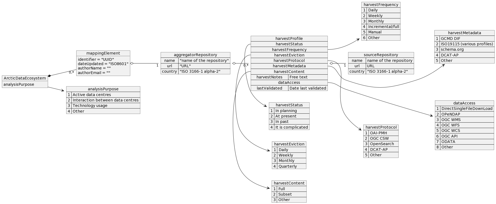

:doctype: article
:pdf-folio-placement: physical
:media: prepress
:sectnums:
:sectlevels: 7
:sectanchors:
:toc: macro
:toclevels: 7
:chapter-label:
:xrefstyle: short
:revnumber: 1.0
:revdate: {docdate}
:revremark: First public version
:title-page:

= Polar Data Ecosystem Mapping Data Model
Date: {docdate}

<<<

:title-page:

<<<
{nbsp} 

image::pictures/ccby.png[]
This work is released under the Creative Commons Attribution 4.0 License. To view a copy of the license, visit https://creativecommons.org/licenses/by/4.0/. 

image:pictures/eu_logo.jpg[width=75,text-align=center]

This work has been supported by the Arctic PASSION project which has received funding from the European Union’s Horizon 2020 research and innovation programme under grant agreement No. 101003472.

[discrete]
== Versions

[cols="^1,1,3,1",]
|=======================================================================
|Version |Date |Comment |Responsible
|1.0 |2023-09-24|First public version|Øystein Godøy
|0.1 |2023-02-16|First consolidated draft. a| Øystein Godøy, Brendan Billingsley
|0.0 |2022-10-18|First draft for internal discussion. |Øystein Godøy
|=======================================================================

<<<

toc::[]

<<<

[[introduction]]
== Introduction

[[background]]
=== Background

The Mapping the Polar Data Ecosystem Project grew from the Mapping the Arctic Data Ecosystem Project that was initiated by the Arctic Data Committee in November of 2014.  Since then, the project has eveloved to include multiple themes using a series of tools.  One of those themes is focused on understanding how the community shares metadata.  During the https://arcticdc.org/meetings/conferences/polar-data-planning-summit[Polar Data Planning Summit] which was arranged May 22 - 24, 2018 in Boulder, Colorado, USA, an effort was initiated to map the ecosystem of Polar data centres and how these interacted exchanging discovery metadata.
This effort was further elaborated in the https://arcticdc.org/meetings/conferences/polar-data-architecture-workshop[Polar Data and Systems Architecture Workshop] which was arranged November 28-30, 2018 in Geneva, Switzerland.
These two meetings resulted in a spreadsheet describing metadata sharing interactions between data centres (i.e. who was harvesting information from whom), information which interoperability standards that were used etc. 

This spreadsheet has since been developed in the joint working group on https://arcticdc.org/activities/core-projects/federated-search[Federated Search for Polar Regions] and in joint the https://arcticdc.org/activities/core-projects/vocabularies-and-semantics-wg[Polar Semantics Working Group]. 
Different aspects have been emphasised in these groups.

In order to simplify analysis of the content of the spreadsheet, it was ingested into a graph database and an application for analysis of relationships was developed (<<mpde-mapping>>).
// Add information on the application and how this was developed. 
This application has evolved through a number of projects and now is in the progress of supporting multiple use cases on interactions between data centres in the Polar regions.
As the number of use cases have increased and the spreadsheet has grown in size it has become evident that managing this information in a spreadsheet is not sustainable.
In order to have a solid basis for further development of the mapping activity and furthermore to move maintenance of information into a suitable system, it was decided to develop a data model for the application. 
This data model should support a wide variety of use cases as well as also support efficient and transparent maintenance of the information collected.
// Need to double check that this was the case, was open at least...
In the process of establishing this data model it has been decided that the content of the mapping activity also shall be available under a CC-BY-4.0 license.

[[mpde-mapping]]
.Screenshot of the second version of Mapping the Polar Data Ecosystem (MPDE) application. The third version is now available at https://mpde.gcrc.carleton.ca 

[[scope]]
=== Scope

This document describes the data model and provides explanations to the various elements.

[[intended-audience]]
=== Intended audience

The intended audience is people interested in the mapping activity and development of the federated search/unified data catalogue for polar data.

== Data model

=== Introduction

The purpose of the data model is to ensure that the necessary information to establish a proper understanding of relationships between data centres, interoperability technologies used and the evolution of relationships is captured in a consistent manner.
The data model should help the community to answer questions like (non exhaustive list):

Which data centres manages polar data?::
Where are polar relevant data managed and how are these data made available to the community?
Which data centres acts as aggregators?::
Some data centres aggregates information from other data centres to provide services to their user communities.
Which are these data centres and how do they interact?
Which interoperability technologies are used?::
Which technologies are actively used to exchange discovery information, but also to convey information about the data.
Which information containers are used for discovery level information??::
Exchange of discovery metadata is the core functionality supporting federated search or unified virtual data catalogues. 
Which information containers are used as well as which semantic annotation is used to describe the contents of data (e.g. variables) and exchange mechanisms (e.g. purpose of URL's in discovery metadata).

=== Diagram

The data model for the polar data ecosystem mapping activity is outlined in <<data-model>>.

analysisPurpose::
The core element in the data model is the "analysisPurpose". 
This should indicate that the underlying data are suitable for answering a number of use cases. 
Each `analysisPurpose` will contain 1 or more `mappingElement`.
Currently the following keywords have been defined:
Active data centres:::
These are the data centres managing polar data.
Interaction between data centres:::
These data centres acts as aggregators in the ecosystem of data centres.
Technology usage:::
These interoperability technologies are actively used for either discovery or access/retrieval purposes.
Other:::
Other use cases, not strictly specified.

mappingElement::
Each `mappingElement` describes a relation between data centres. 
In order to track the information over time, the element has a number of attributes.
A unique internal `identifier` which is used to separate `mappingElement` elements from each other.
The time this information was last updated in `dateUpdated`, this information is captured following ISO8601. 
And name and email of the person providing the updated information in `authorName` and `authorEmail`.
Each `mappingElement` contain 1 `aggregatorRepository` element. 

aggregatorRepository::
This describes a repository that is harvesting information from other data repositories. 
For each repository the name, url and country (respective attributes are `name`, `url` and `country`) is needed to support the top level use cases.
The `url` should be the landing/front page of the repository.
Each `aggregatorRepository` element will have 0 or elements of type `harvestProfile` that describes the relations and technologies used. Each `harvestProfile` of an `aggregatorRepository` is linked with a `sourceRepository`. 
harvestProfile:::
harvestStatus::::
States whether the repository is actively harvested, has been in the past or is in planning.
See <<data-model>> for details.
harvestFrequency::::
How often are the information retrieved by the aggregator. 
See <<data-model>> for details.
harvestEviction::::
Describes how often the aggregator evict all information harvested and do a clean full harvest again.
See <<data-model>> for details.
harvestProtocol::::
Identifies the interoperability protocol used to exchange information on discovery metadata between the source and the aggregator.
The link between a aggregator and a source is only one protocol, but a source may be harvested using different protocols by different aggregators.
See <<data-model>> for details.
harvestMetadata::::
The discovery metadata standard the aggregator is retrieving from the source.
See <<data-model>> for details.
harvestContent::::
Indicates if incremental or full harvests are used. 
This should be interpreted in combination with `harvestFrequency`.
harvestNotes::::
Any comment added as free text supporting the understanding of the relation between the aggregator and the source.
dataAccess::::
Indicates which mechanisms an aggregator is using to integrate the data provided by the source in the service portfolio of the aggregator. 
Typically this can be multiple elements for each aggregator/source linkage.
This will be a list.
lastValidated::::
Information on when the current content of the harvesting was confirmed by the aggregator.
Also using ISO8601.
sourceRepository:::
This describes the data repository that is being harvested by the `aggregatorRepository`. 
The information provided for this element is the same as for the `aggregatorRepository` (i.e. name, url, country), but the information on metadata standards, protocols etc in `harvestProfile` reflects the services offered by the `sourceRepository` as they are actively utilised by the aggregator.

[.landscape]
<<<
[[data-model]]
.Data model for the polar data ecosystem mapping activity.

[.portrait]
<<<
